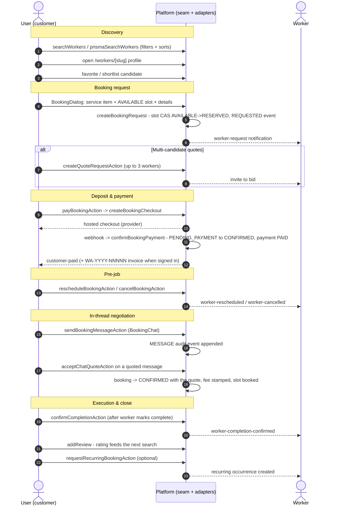
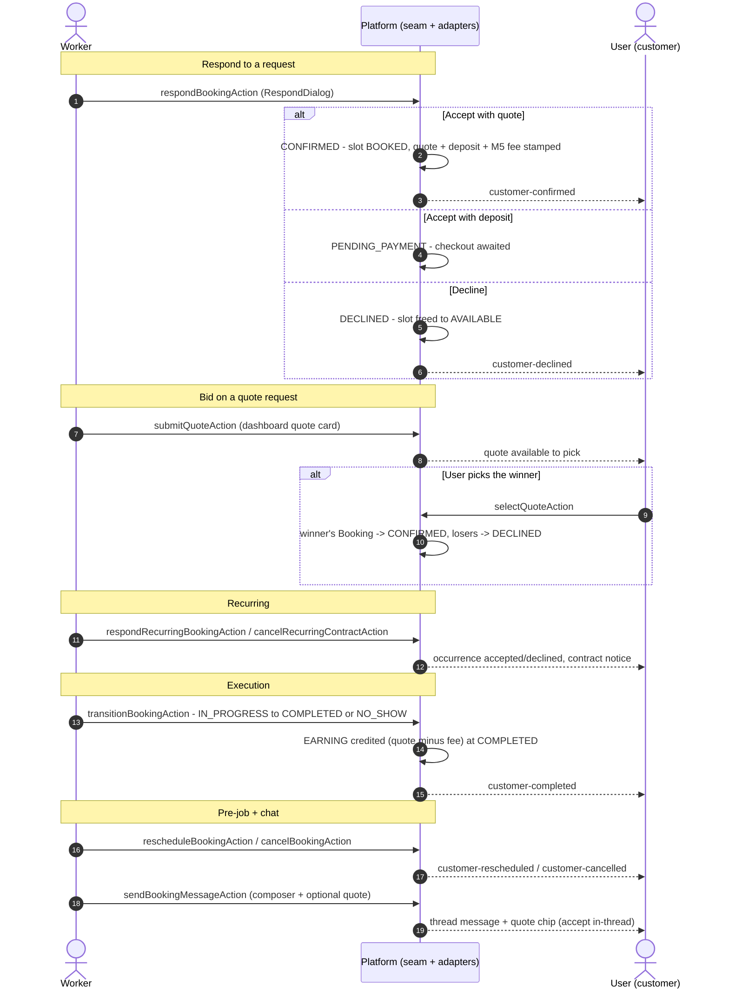
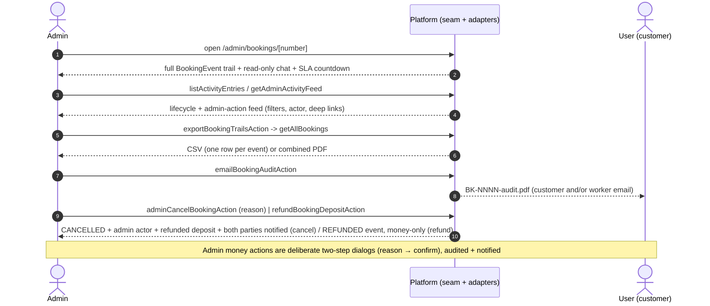
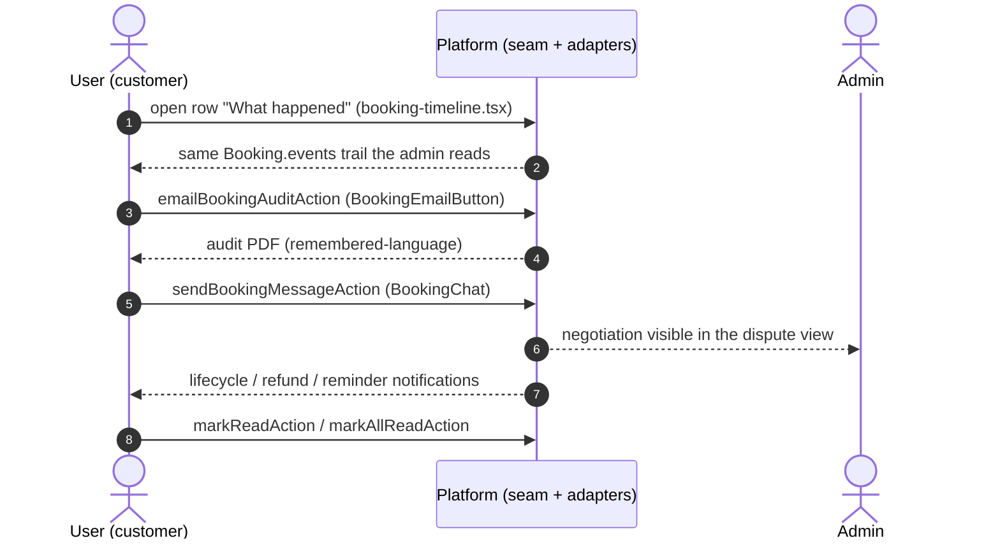
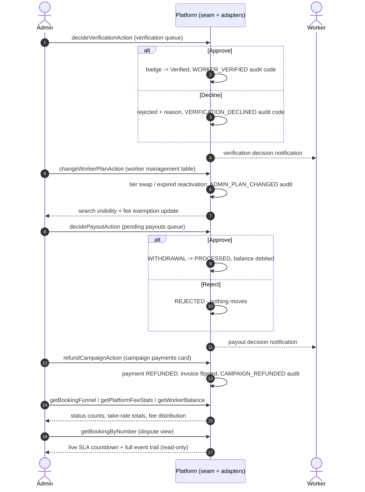
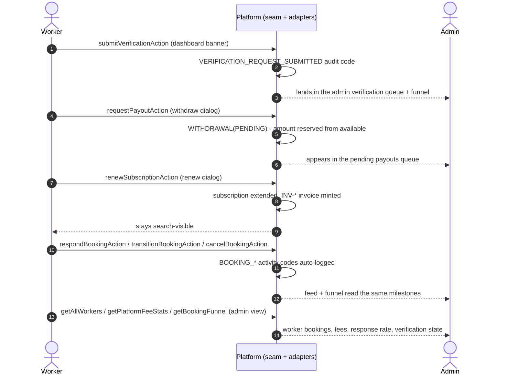
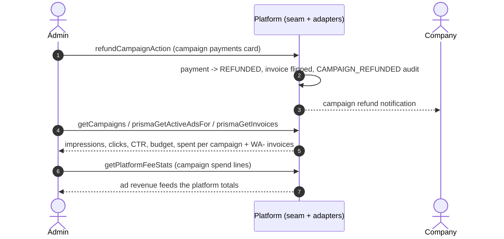
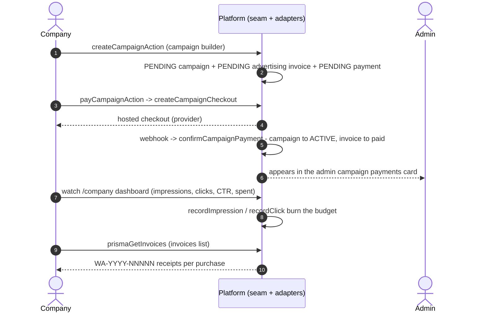

# WorkersArena — Interaction Workflows & Revenue Map

[← Back to docs index](README.md)

**Status:** ✅ Live (describes the implemented flows, both adapters — demo in-memory `src/lib/data/bookings.ts` and production Prisma `src/lib/data/prisma-repo.ts` — behind the shared seam `src/lib/data/repo.ts`; the UI never changes between modes).

This document maps **who talks to whom** on the platform and **where the money comes from**. It is the companion to `docs/selection-workflow.md` (customer ⇄ worker booking story), `docs/booking-take-rate.md` (M5 fee), `docs/payouts.md` (worker ledger), `docs/PAYMENTS.md` (deposits/ads), and `docs/BUSINESS-MODEL.md` (revenue strategy). Each section covers one directed interaction: what one party can do to/with the other, the trigger, the server action + seam, and the notification/audit trail it leaves.

**Roles:** `customer` (end user / client), `worker` (service professional), `company` (advertiser / B2B), `admin` (platform operator). "User" below = customer unless stated.

---

## 1. User ⇄ Worker (customer ⇄ worker)

The core marketplace loop. Full step-by-step story + sequence diagram in `docs/selection-workflow.md`; this section is the two directed halves.

### 1.1 User → Worker

| # | Interaction | Trigger (UI) | Server path | Outcome |
|---|---|---|---|---|
| 1 | **Search & shortlist** | `/search` filters/sorts, homepage, `/favorites`, related workers | `searchWorkers` / `prismaSearchWorkers`, `getSuggestions`, `getFeaturedWorkers` | Candidate list; worker gets profile views + lead counts |
| 2 | **Review profile** | `/workers/[slug]` | `getWorkerBySlug` (demo/prisma) | User judges rating, reviews, badges, services, hours |
| 3 | **Book** | `BookingDialog` (service item → AVAILABLE slot → details) | `requestBookingAction` → `createBookingRequest` (slot CAS `AVAILABLE→RESERVED` + overlap guard + `REQUESTED` event) | `REQUESTED` booking + slot reserved; worker notified (`worker-request`) |
| 4 | **Request quotes (multi-candidate)** | "Request quotes from up to 3 workers" | `createQuoteRequestAction` → `createQuoteRequest` | `QuoteRequest(OPEN)`; invited workers notified to bid |
| 5 | **Pay deposit** | `/bookings` pay card | `payBookingAction` → `createBookingCheckout` → provider → webhook `confirmBookingPayment` | `PENDING_PAYMENT → CONFIRMED` + payment PAID (+ `WA-YYYY-NNNNN` invoice for signed-in users); notified `customer-paid` |
| 6 | **Reschedule / cancel** | row action | `rescheduleBookingAction` / `cancelBookingAction` | `RESCHEDULED` / `CANCELLED` audit event; other party notified (`worker-rescheduled` / `worker-cancelled`); deposit refund per policy |
| 7 | **Review after job** | `/bookings` completed row | `addReview` (seam, both adapters) | Worker rating/reviewCount updated — feeds next user's search |
| 8 | **Chat + accept quote** | `BookingChat` on the row | `sendBookingMessageAction`; on a worker's quoted message `acceptChatQuoteAction` | Message appended + `MESSAGE` audit event; quote accepted → `CONFIRMED` with the amount, fee stamped, slot booked |
| 9 | **Confirm completion** | `confirmCompletionAction` (after the worker marks complete) | seam → both adapters | Completion confirmed to the worker (`worker-completion-confirmed`); cancels the auto-confirm timer |
| 10 | **Request a recurring contract** | booking dialog → recurring | `requestRecurringBookingAction` → `createRecurringRequest` | `RecurringBooking` + first `Booking` occurrence |

### 1.2 Worker → User

| # | Interaction | Trigger (UI) | Server path | Outcome |
|---|---|---|---|---|
| 1 | **Accept / decline / counter** | `RespondDialog` on dashboard Requests tab | `respondBookingAction` → `respondToBooking` | Accept → `CONFIRMED` (slot BOOKED, quote + deposit + M5 fee stamped); accept-with-deposit → `PENDING_PAYMENT`; decline → `DECLINED` + slot freed; user notified `customer-confirmed` / `customer-declined` |
| 2 | **Bid on a quote request** | dashboard quote card → `submitQuoteAction` | `submitQuote` | Bid lands on the `QuoteRequest`; user picks the winner (`selectQuoteAction`) → winner's `Booking` flips to `CONFIRMED`, losers `DECLINED` |
| 3 | **Respond to recurring visit / cancel contract** | dashboard recurring rows | `respondRecurringBookingAction` / `cancelRecurringContractAction` | Occurrence accepted/declined; contract terminated with notice |
| 4 | **Start / complete / no-show** | `transitionBookingAction` on the row | `transitionBooking` (`BOOKING_TRANSITION_FROM` + CAS) | `IN_PROGRESS → COMPLETED` (user notified `customer-completed`; worker EARNING credited `quote − fee` at completion) or `NO_SHOW` |
| 5 | **Reschedule / cancel** | row action | `rescheduleBookingAction` / `cancelBookingAction` | Same as §1.1.6; user notified `customer-rescheduled` / `customer-cancelled` |
| 6 | **Chat: message + quote** | `BookingChat` composer (+ optional price) | `sendBookingMessageAction` (worker-side quote field) | Thread message + quote chip; `MESSAGE` audit event; user can accept in-thread (§1.1.8) |

**Shared affordances:** `BookingChat` (typing indicator + read receipts — `markChatReadAction` / `setChatTypingAction` / `getChatPresenceAction`, party-gated), `BookingPrintButton` / `BookingEmailButton` (print or email the audit trail PDF), and the "What happened" timeline (`booking-timeline.tsx`) — all three surfaces render the same dispute trail.

---

## 2. Admin ⇄ User (admin ⇄ customer)

Admin-facing user surfaces live on `/admin` and `/admin/bookings/[number]`; user-facing admin surfaces are the dispute timeline, the audit email/print, and notifications.

### 2.1 Admin → User

| # | Interaction | Where | Server path | Outcome |
|---|---|---|---|---|
| 1 | **View any booking's full dispute timeline** | `/admin/bookings/[number]` | `getBookingByNumber` (seam) | Every `BookingEvent` (actor, timestamp, reason) + chat thread read-only + SLA countdown |
| 2 | **Read the whole activity feed** | `/admin` → Recent activity | `listActivityEntries` / `getAdminActivityFeed` (file or `ActivityLog`) | Lifecycle + admin-action feed with filters, actor, deep links |
| 3 | **Export the entire book's trails** | `/admin` booking-funnel card → Export trails (CSV/PDF) | `exportBookingTrailsAction` → `getAllBookings` | One CSV row per event, or a combined PDF — offline audit |
| 4 | **Send a customer's audit PDF** | admin dispute page → Email audit | `emailBookingAuditAction` | `BK-<number>-audit.pdf` to the customer's email (and/or worker's) |
| 5 | **Cancel a booking** (platform decision) | admin dispute page → Cancel booking | `adminCancelBookingAction` → `cancelBooking` (`by: "admin"`) | CANCELLED + admin actor + reason in the trail, slot freed, PAID deposit refunded (always — no policy window), **both** parties notified |
| 6 | **Refund a PAID deposit** (money-only correction) | admin dispute page → Refund deposit | `refundBookingDepositAction` → `refundBookingDeposit` | Booking + slot untouched, payment → REFUNDED, REFUNDED audit event (admin actor), customer refund email; idempotent (no double-refund) |

### 2.2 User → Admin

| # | Interaction | Where | Server path | Outcome |
|---|---|---|---|---|
| 1 | **See the same dispute trail** | `/bookings` row → "What happened" | reads `Booking.events` (same data the admin page reads) | User sees exactly what the admin sees (one story, three surfaces) |
| 2 | **Print / email the audit trail** | `BookingPrintButton` / `BookingEmailButton` on the row | `emailBookingAuditAction` (permission-gated: admin, owning customer, or worker) | Paper trail on demand; remembered-language PDF |
| 3 | **File a dispute context via chat** | `BookingChat` (messages land in the trail) | `sendBookingMessageAction` | Negotiation visible to the admin in the dispute view |
| 4 | **Receive notifications** | bell + `/notifications` | `markReadAction` / `markAllReadAction` | Lifecycle + refund + reminder notifications, multi-channel |

---

## 3. Admin ⇄ Worker

The largest admin surface — worker management, verification, plans, payouts, and the booking funnel.

### 3.1 Admin → Worker

| # | Interaction | Where | Server path | Outcome |
|---|---|---|---|---|
| 1 | **Approve / decline verification** | `/admin` verification queue | `decideVerificationAction` → seam `decideVerification` | Worker badge → Verified (or rejected with reason); `WORKER_VERIFIED` / `VERIFICATION_DECLINED` audit codes; worker notified |
| 2 | **Change a worker's plan inline** | `/admin` Worker management table → inline select → confirm dialog | `changeWorkerPlanAction` → `changeWorkerPlan` (`applyPlanChange` pure logic) | Tier swap / expired reactivation; `ADMIN_PLAN_CHANGED` audit entry with the admin's id; search visibility changes immediately (fee-waived Enterprise etc.) |
| 3 | **Approve / reject payout** | `/admin` Pending payouts queue | `decidePayoutAction` → `decidePayout` (CAS on PENDING) | `WITHDRAWAL` → `PROCESSED` (money settled) or `REJECTED` (nothing moves); `reviewedBy`/`reviewedAt` stamped; worker notified |
| 4 | **Refund an ad campaign** | `/admin` campaign payments card | `refundCampaignAction` → `refundCampaign` | Campaign → refunded, payment REFUNDED, invoice flipped; `CAMPAIGN_REFUNDED` audit code |
| 5 | **Watch the worker-side funnel** | `/admin` booking funnel + fees + platform stats | `getBookingFunnel`, `getPlatformFeeStats`, `getWorkerBalance`/ledger | Status counts, take-rate totals, fee distribution per plan |
| 6 | **Watch the live SLA clock + dispute trail** | `/admin/bookings/[number]` | `getBookingByNumber` (read-only) | The admin reads the same ticking SLA countdown and full `BookingEvent` trail the customer/worker rows render — admins are **read-only** on bookings (no admin booking mutations; transitions happen on the worker/customer side) |

### 3.2 Worker → Admin

| # | Interaction | Where | Server path | Outcome |
|---|---|---|---|---|
| 1 | **Submit verification documents** | dashboard → verification banner | `submitVerificationAction` → seam `submitVerification` | `VERIFICATION_REQUEST_SUBMITTED` audit code; lands in the admin queue with the funnel stats |
| 2 | **Request a payout** | dashboard → Payouts card → withdraw dialog | `requestPayoutAction` → `requestPayout` (validates `amount ≤ available − pending`) | `WITHDRAWAL(PENDING)` row; appears in the admin queue; worker's available balance reduced by the reserved amount |
| 3 | **Renew / switch subscription** | dashboard → renew dialog | `renewSubscriptionAction` (plan + period) | Subscription extended (monthly / annual); `INV-*` invoice minted; worker stays search-visible |
| 4 | **Signal SLA / lifecycle events** | every booking action the worker takes | `respondBookingAction`, `transitionBookingAction`, etc. | Auto-logged `BOOKING_*` activity codes the admin feed + funnel read |
| 5 | **Appear in the admin funnel/reporting** | `/admin` stats | `getAllWorkers`, `getPlatformFeeStats`, `getBookingFunnel` | Worker's bookings, fees, response rate, verification state feed the admin's cards |

---

## 4. Admin ⇄ Company

The B2B advertising surface. Companies buy campaigns; admins watch spend, refund, and audit.

### 4.1 Admin → Company

| # | Interaction | Where | Server path | Outcome |
|---|---|---|---|---|
| 1 | **Refund a campaign purchase** | `/admin` campaign payments card | `refundCampaignAction` → `refundCampaign` | Payment → REFUNDED, campaign → refunded, advertising invoice flipped; `CAMPAIGN_REFUNDED` audit code; company notified |
| 2 | **Audit ad spend** | `/admin` companies / active-ads stats + campaigns card | `getCampaigns`, `prismaGetActiveAdsFor`, `prismaGetInvoices` | Impressions/clicks/CTR/budget/spent per campaign; WA- invoices list |
| 3 | **Watch platform revenue from ads** | `/admin` revenue cards + fees card | `getPlatformFeeStats` (campaign spend lines) | Ad revenue feeds the platform totals |

### 4.2 Company → Admin

| # | Interaction | Where | Server path | Outcome |
|---|---|---|---|---|
| 1 | **Create a campaign** | `/company` campaign builder (8 ad types, placement/category/city targeting, budget) | `createCampaignAction` → `createCampaign` | PENDING campaign + PENDING advertising invoice + PENDING payment |
| 2 | **Pay for the campaign** | hosted checkout (redirect from builder) | `payCampaignAction` → `createCampaignCheckout` → provider → webhook `confirmCampaignPayment` | Campaign → ACTIVE (starts serving ads — `getActiveAdsFor` only matches ACTIVE), invoice → paid; appears in the admin campaign payments card |
| 3 | **Watch campaign performance** | `/company` dashboard (impressions / clicks / CTR / spent) | `getCampaigns` (per-company), impression/click tracking via `/api/ads/[id]/click` | Spent burns budget ($0.01/impression, $1/click demo model); WA- invoice list |
| 4 | **View invoices** | `/company` → Invoices list | `prismaGetInvoices` (real Prisma rows in real mode) | Every purchase's `WA-YYYY-NNNNN` receipt |

---

## 5. Revenue generated by each party

WorkersArena monetizes **three** distinct flows. Amounts are integer minor units internally; the platform's own books track fees + subscriptions + ad spend.

### 5.1 From workers — subscriptions (live, the base revenue stream)

| Plan | USD/month | What it gates |
|---|---|---|
| Basic | $29 | listing, leads |
| Professional | $59 | + boost, verified badge |
| Premium | $119 | + analytics, gallery |
| Enterprise | $299 | + emergency marker, priority support, ads — **and take-rate exemption** (fee waived) |

- Renewal mints an `INV-*` invoice; annual = 10 months paid, 12 months term.
- Expiry hides the worker from public search — the natural upsell trigger.
- Admin can change plans inline (audited) and reactivate expired subscriptions.

### 5.2 From bookings — platform take rate (M5, live)

- **Rate:** `PLATFORM_FEE_RATE_BPS = 700` (7.0%), floor `500` minor (SAR 5 / $5), cap `30_000` minor (SAR 300 / $300) per job — `computePlatformFee` in `src/lib/data/booking-ui.ts`.
- **When:** stamped once at **accept-with-quote** on the **quote** (not the deposit, not on top), as an immutable snapshot (`Booking.platformFee` + `platformFeeRateBps`).
- **Exempt:** Enterprise plan → fee 0.
- **Who pays:** effectively the worker — the worker sees "you receive X · platform fee Y" in the RespondDialog; the customer sees the total with an "includes platform fee · worker receives" line.
- **Settlement:** worker earnings = `quote − platformFee`, credited to the `WorkerLedgerEntry` **at COMPLETED** (idempotent via `@@unique([bookingId])`), then withdrawn through the admin-reviewed payout queue.

### 5.3 From companies — advertising (live purchase flow, simulated money until a real gateway)

- **Purchase:** campaign creation → hosted checkout → payment webhook → ACTIVE + paid advertising invoice (`INV-*` scope advertising, then `WA-YYYY-NNNNN`).
- **Spend model (demo):** ~$10 CPM + $1/click — `recordImpression` burns $0.01/impression, `recordClick` burns $1/click; spent accrues against the campaign budget.
- **Refunds:** admin can refund a campaign; the invoice flips and `CAMPAIGN_REFUNDED` is audited.

### 5.4 Platform-level totals (what the admin sees)

- `/admin` revenue cards: total revenue + monthly revenue (subscriptions + ad spend).
- `/admin` fees card (`admin.feesTitle`): take-rate totals — per-plan fee distribution (incl. the Enterprise-exempt line) from `getPlatformFeeStats`.
- Booking funnel: status counts (REQUESTED → CONFIRMED → completed/cancelled/no-show), the same story as the activity feed.
- Campaigns card: per-campaign budget/spent/status with refund action; companies count + active ads stat cards.

### 5.5 Money the platform does *not* take (currently)

- **No transaction fee on top of quotes** beyond the M5 take rate (which is the take).
- **No fee on deposits** (a deposit is partial pre-payment of the quote).
- **No customer-side fees** — customers pay only the worker's quote (+ deposit when required).
- **No fee on quote requests / multi-candidate quotes** — bidding is free for workers.
- **No charge for reviews, favorites, verification, leads, or analytics.**

---

## 6. Cross-party summary matrix

| From → To | Interactions (count) | Revenue to platform |
|---|---|---|
| User → Worker | search, profile, book, quote-request, pay, reschedule/cancel, review, chat, accept-quote, recurring, confirm-completion | — (fee via booking) |
| Worker → User | accept/decline/counter, bid, respond recurring, start/complete/no-show, reschedule/cancel, chat+quote | — (fee via booking) |
| Admin → User | dispute timeline, export trails, email audit | — |
| User → Admin | dispute timeline, print/email audit, chat trail, notifications | — |
| Admin → Worker | verification decision, plan change, payout decision, campaign refund, funnel/fees visibility | subscription + take-rate stewardship |
| Worker → Admin | verification submit, payout request, renew/switch plan, lifecycle signals | subscriptions + take-rate |
| Admin → Company | campaign refund, ad-spend audit, revenue watch | ad revenue |
| Company → Admin | campaign create, pay, performance watch, invoices | ad spend |

**Money flows:** Worker → platform (subscription) · platform → worker (payouts = quote − fee) · Company → platform (campaign budget) · platform ↔ company (refund) · User → worker (quote + deposit) · User → platform (nothing directly).
