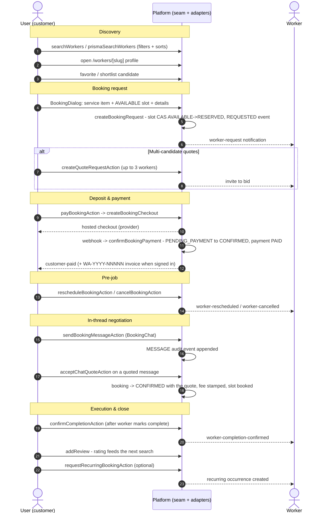
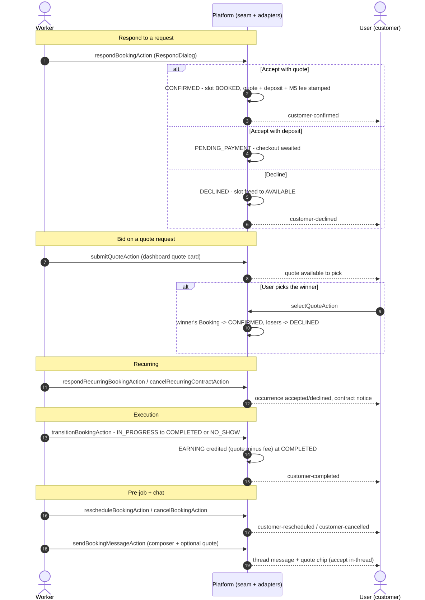
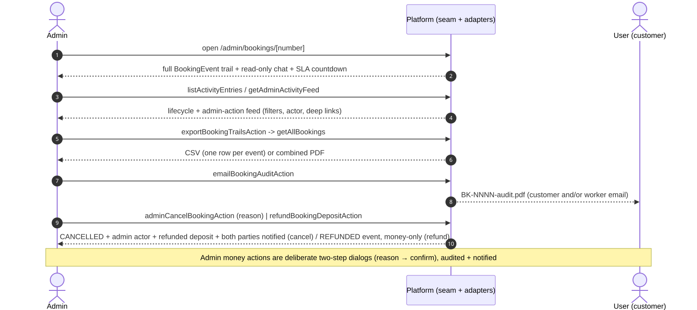
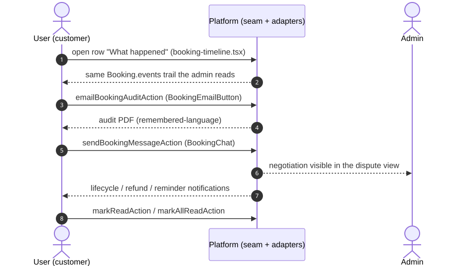
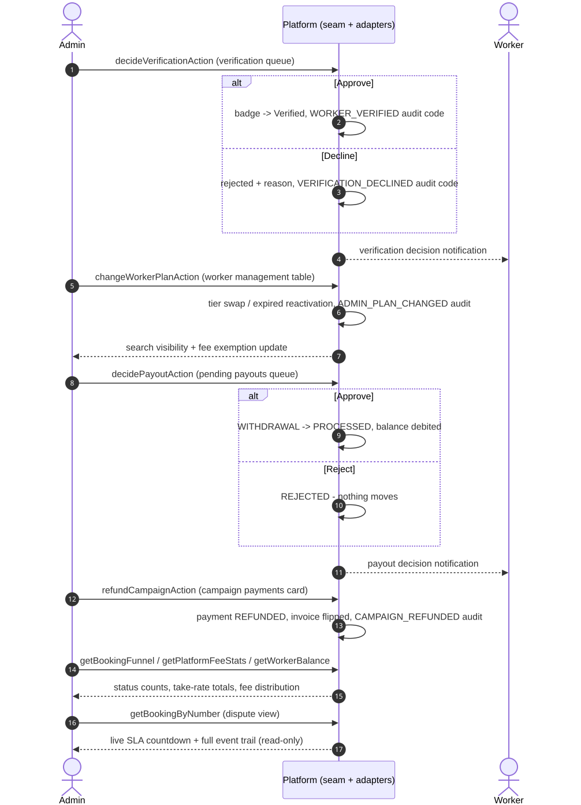
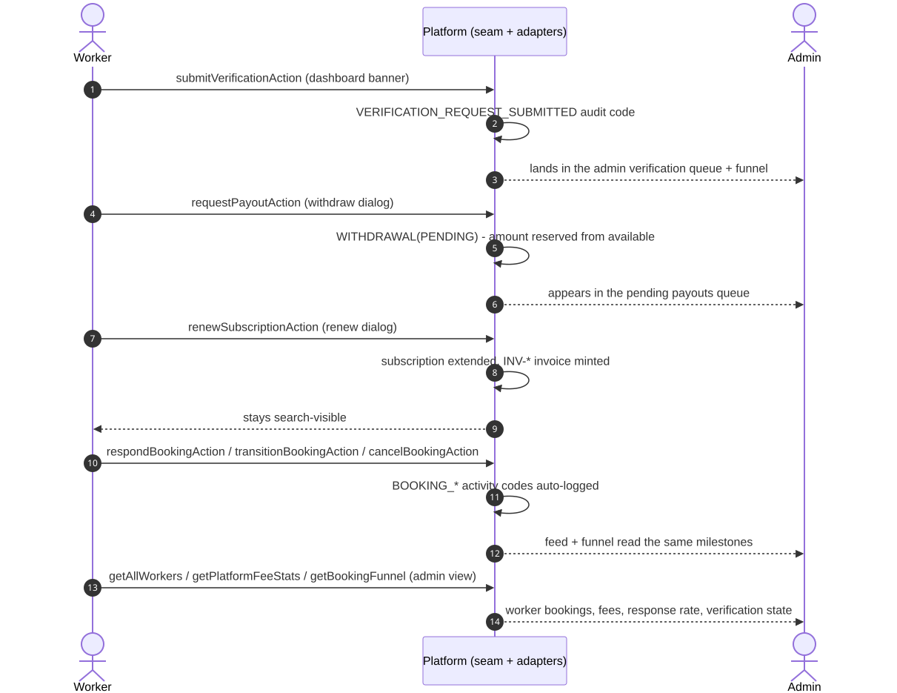
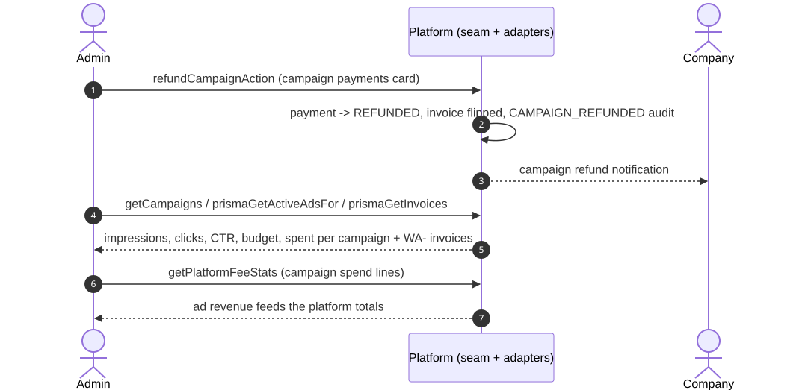
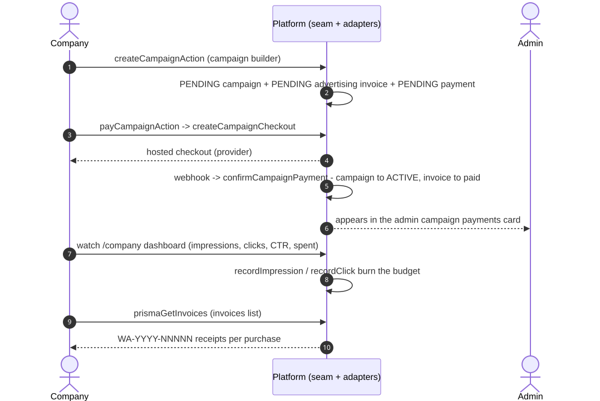
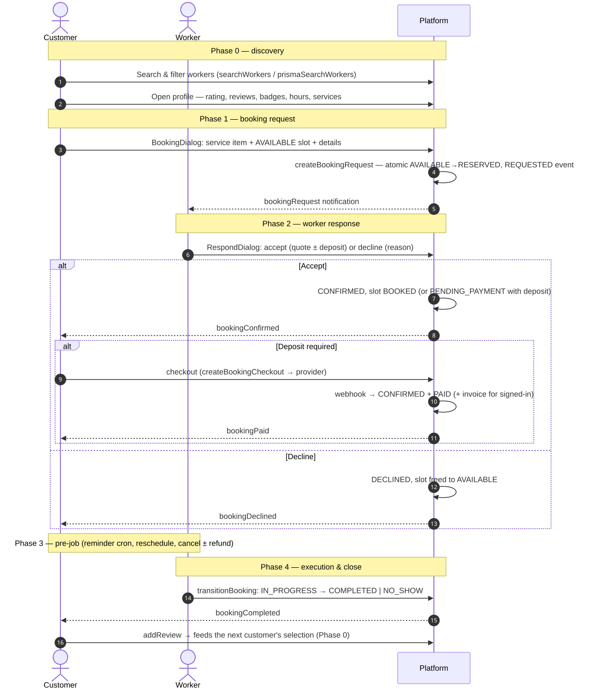
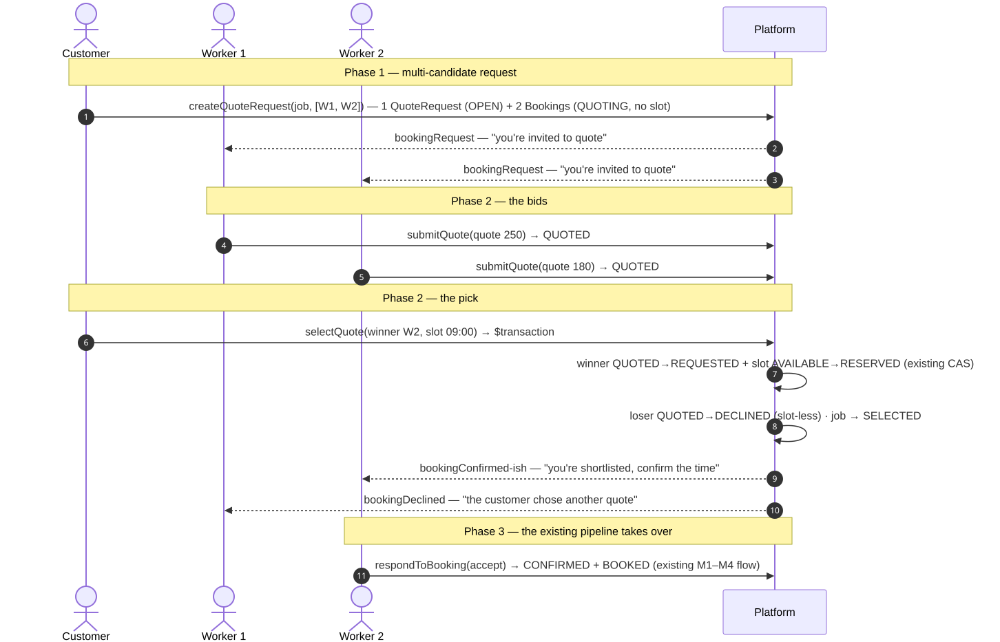

# WorkersArena — Docs Index

This folder is the project's living documentation. Start here to find the right doc, then follow the cross-references — every doc links its neighbors so you can trace a feature from **strategy → design → workflow → money**.

**Quick orientation:**

- **What the product is / could be** → [PRODUCT.md](PRODUCT.md) (feature inventory + roadmap) · [ENHANCEMENT-PLAN.md](ENHANCEMENT-PLAN.md) (what ships next, features *and* workflow) · [MULTI-COUNTRY-AND-QUALITY-PLAN.md](MULTI-COUNTRY-AND-QUALITY-PLAN.md) (tenant audit + bug/UX plan)
- **How it's built** → [ARCHITECTURE.md](ARCHITECTURE.md) · [API.md](API.md) · [DEPLOYMENT.md](DEPLOYMENT.md) · [mobile-architecture.md](mobile-architecture.md)
- **Trust & safety** → [REVIEW-MODERATION.md](REVIEW-MODERATION.md) (the review publication gate + weighted ranking)
- **How the parties interact** (the workflow docs) → [INTERACTION-WORKFLOWS.md](INTERACTION-WORKFLOWS.md) (start here) · [selection-workflow.md](selection-workflow.md) · [booking-scheduling.md](booking-scheduling.md) · [booking-customer-ui.md](booking-customer-ui.md) · [multi-candidate-quotes.md](multi-candidate-quotes.md)
- **Where the money comes from** → [BUSINESS-MODEL.md](BUSINESS-MODEL.md) · [PAYMENTS.md](PAYMENTS.md) · [fee-rules.md](fee-rules.md) (configurable take rate + platform credits) · [lead-marketplace.md](lead-marketplace.md) (paid qualified leads) · [booking-take-rate.md](booking-take-rate.md) · [booking-settlement.md](booking-settlement.md) (what was actually collected) · [payouts.md](payouts.md)
- **User-facing manual (Word)** → [WorkersArena-User-Manual.docx](WorkersArena-User-Manual.docx) — every module, step-by-step usage, and each role's job (regenerated from `scripts/generate-user-manual.mjs`)

---

## Cross-reference table

| Doc | What it covers | Workflow & related docs it links |
|---|---|---|
| **[PRIVACY-COMMUNICATION-FLOW.md](PRIVACY-COMMUNICATION-FLOW.md)** | **Privacy-preserving communication:** masked phone numbers, emergency bypass, SMS fallback, admin dashboards, 7-step flow. | → [booking-scheduling.md](booking-scheduling.md) (booking lifecycle) · [ARCHITECTURE.md](ARCHITECTURE.md) (system overview) · [API.md](API.md) (endpoints) |
| **[INTERACTION-WORKFLOWS.md](INTERACTION-WORKFLOWS.md)** | **The map: who talks to whom.** Every directed interaction between user ⇄ worker, admin ⇄ user, admin ⇄ worker, admin ⇄ company (trigger → server path → outcome), plus the revenue each party generates. 8 Mermaid sequence diagrams. | → [selection-workflow.md](selection-workflow.md) (user⇄worker booking story) · [booking-take-rate.md](booking-take-rate.md) (M5 fee) · [payouts.md](payouts.md) (worker ledger) · [PAYMENTS.md](PAYMENTS.md) (deposits/ads) · [BUSINESS-MODEL.md](BUSINESS-MODEL.md) (revenue strategy) |
| **[selection-workflow.md](selection-workflow.md)** | The customer ⇄ worker **selection story** end-to-end: discovery → booking request → worker response → pre-job → execution & close, with the trust/fairness guarantees + sequence diagram. | → [booking-scheduling.md](booking-scheduling.md) (the five service rules) · [INTERACTION-WORKFLOWS.md](INTERACTION-WORKFLOWS.md) (the full interaction map) · [booking-customer-ui.md](booking-customer-ui.md) (customer UI) · [multi-candidate-quotes.md](multi-candidate-quotes.md) (the structural fix to selection) |
| **[booking-scheduling.md](booking-scheduling.md)** | Booking & scheduling mechanics: slot model, request/confirm lifecycle, the canonical five rules, availability editor, reminder cron, deposits + invoices, worker dashboard. | → [selection-workflow.md](selection-workflow.md) (the workflow that uses these rules) · [booking-customer-ui.md](booking-customer-ui.md) (customer dialog/rows) · [PAYMENTS.md](PAYMENTS.md) (deposits) · [multi-candidate-quotes.md](multi-candidate-quotes.md) (auction reuse) · [INTERACTION-WORKFLOWS.md](INTERACTION-WORKFLOWS.md) |
| **[booking-customer-ui.md](booking-customer-ui.md)** | The customer-facing booking UI (BookingDialog → service/slot/details, `/bookings` tracking page) — component plan + status. | → [booking-scheduling.md](booking-scheduling.md) (the data model it drives) · [selection-workflow.md](selection-workflow.md) (the workflow it serves) · [INTERACTION-WORKFLOWS.md](INTERACTION-WORKFLOWS.md) |
| **[multi-candidate-quotes.md](multi-candidate-quotes.md)** | "Request quotes from up to 3 workers": the `QuoteRequest` auction layer that reuses `Booking` as the per-worker bid record, winner selection, quote SLA. | → [selection-workflow.md](selection-workflow.md) (it replaces one-shot booking in selection) · [booking-scheduling.md](booking-scheduling.md) (reused slot/event/notification rails) · [INTERACTION-WORKFLOWS.md](INTERACTION-WORKFLOWS.md) (quote-request flows in §1) |
| **[fee-rules.md](fee-rules.md)** | **Configurable platform fee rules:** the versioned rule set (plan tiers, categories, emergency, promotions, floor/cap/fixed), the pure fee engine, the immutable per-quote snapshot, the admin editor, and what each layer can price. | → [booking-take-rate.md](booking-take-rate.md) (the M5 fee it generalizes) · [BUSINESS-MODEL.md](BUSINESS-MODEL.md) (pricing strategy) · [payouts.md](payouts.md) (fee → net) · [PAYMENTS.md](PAYMENTS.md) (settlement) · [REVENUE-STREAMS.md](REVENUE-STREAMS.md) (stream catalog) |
| **[lead-marketplace.md](lead-marketplace.md)** | **The qualified lead marketplace (§7–§10):** bronze/silver/gold/emergency grading, the weighted matching engine that offers a request to only a few suitable workers, paid exclusive leads with ownership caps and expiry, and the configurable contact-reveal policy. Plus the credit-ledger purchase path and the admin policy panel. | → [fee-rules.md](fee-rules.md) (the rule set + credit ledger it uses) · [multi-candidate-quotes.md](multi-candidate-quotes.md) (the auction a lead converts into) · [PRIVACY-COMMUNICATION-FLOW.md](PRIVACY-COMMUNICATION-FLOW.md) (the other contact-privacy mechanism) · [BUSINESS-MODEL.md](BUSINESS-MODEL.md) (where it sits in the model) · [INTERACTION-WORKFLOWS.md](INTERACTION-WORKFLOWS.md) |
| **[REVIEW-MODERATION.md](REVIEW-MODERATION.md)** | **The review publication gate:** a submitted review is pending until an admin decides — invisible and uncounted — with the triage signals (contact details, links, unverified, bare extreme ratings), the rejection vocabulary, the lifetime-aggregate vs. weighted-ranking split, and the `/admin/reviews` queue. | → [selection-workflow.md](selection-workflow.md) (where the review site sits in the customer⇄worker story) · [ARCHITECTURE.md](ARCHITECTURE.md) (the demo ⇄ Prisma adapter convention) · [BUSINESS-MODEL.md](BUSINESS-MODEL.md) (trust keeps the take rate sellable) · [INTERACTION-WORKFLOWS.md](INTERACTION-WORKFLOWS.md) |
| **[booking-take-rate.md](booking-take-rate.md)** | The M5 platform fee: rate/floor/cap policy, `computePlatformFee`, stamp-at-accept, fee/exempt display, settlement. | → [fee-rules.md](fee-rules.md) (the versioned engine that now owns the rate) · [BUSINESS-MODEL.md](BUSINESS-MODEL.md) (the revenue thesis) · [payouts.md](payouts.md) (fee → net earnings → payout) · [PAYMENTS.md](PAYMENTS.md) (settlement rails) · [INTERACTION-WORKFLOWS.md](INTERACTION-WORKFLOWS.md) (§5.2 revenue) |
| **[booking-settlement.md](booking-settlement.md)** | **What the platform actually collected:** the settlement engine's invariant (the ledger never credits more than was collected), the second payment leg (`Booking.settlementPaymentId`), the seven money states, the customer pay-balance card, the worker's "settled directly" declaration, outside-platform fee claims, and the admin reconciliation that shows stamped-vs-collected fees and the unbacked-credit canary. | → [booking-take-rate.md](booking-take-rate.md) (the fee being settled) · [payouts.md](payouts.md) (where the credit lands) · [PAYMENTS.md](PAYMENTS.md) (the rails both legs ride) · [fee-rules.md](fee-rules.md) (which decides the fee) · [BUSINESS-MODEL.md](BUSINESS-MODEL.md) (collectable revenue) |
| **[guest-claim.md](guest-claim.md)** | **A phone-keyed guest booking finds its account:** the five claim rules (the phone is the credential, an email alone never claims, the phone is also the candidacy test, an owned record is never taken, re-running is free), the three record families it covers (`Booking` / `QuoteRequest` / `RecurringBooking` + `claimedAt`), the compare-and-swap write, and the `/bookings` banner that says it out loud. | → [demand-growth.md](demand-growth.md) (the phase it belongs to) · [booking-scheduling.md](booking-scheduling.md) · [ENHANCEMENT-PLAN.md](ENHANCEMENT-PLAN.md) |
| **[review-solicitation.md](review-solicitation.md)** | **Asking for the review at the moment it is earned:** the completion-time ask, the single reminder, and why the window closes at 30 days; why "already reviewed" counts a review still in the moderation queue; and why `verifiedPurchase` is computed from the reviewer's own completed bookings rather than claimed. | → [demand-growth.md](demand-growth.md) (the phase it belongs to) · [booking-settlement.md](booking-settlement.md) (when a job counts as completed) · [ENHANCEMENT-PLAN.md](ENHANCEMENT-PLAN.md) |
| **[seo-cross-landing.md](seo-cross-landing.md)** | **Trade × city landing pages:** how `/{locale}/trades/{trade}/{city}` derives its copy from the catalogue instead of a hand-written table, why the index floor is 1 and why an empty pair is `noindex` (but still readable), and why the sitemap and the hubs link only to pairs that have supply. | → [demand-growth.md](demand-growth.md) (the phase it belongs to) · [ENHANCEMENT-PLAN.md](ENHANCEMENT-PLAN.md) |
| **[booking-entry.md](booking-entry.md)** | **A share that lands on a filled-in booking:** the `?book=` / `?slot=` / `?src=` link, why its resolution happens server-side against live rows, the three staleness outcomes (`unknown-service`, `slot-unavailable`, `slot-past`) and why a stale link still opens the dialog, and why the share takes the browser's own origin over the build-time one. | → [demand-growth.md](demand-growth.md) (the phase it belongs to) · [booking-scheduling.md](booking-scheduling.md) · [ENHANCEMENT-PLAN.md](ENHANCEMENT-PLAN.md) |
| **[demand-growth.md](demand-growth.md)** | **Phase 2 — going after the scarcer side:** instant booking (buy the job at a published price without waiting for a quote), the fixed-price package editor that gives the opt-in something to sell, and per-category price benchmarks derived from jobs already priced (percentiles, a sample floor, and why the band is rounded). | → [booking-settlement.md](booking-settlement.md) (why an instant sale must be funded up front) · [booking-scheduling.md](booking-scheduling.md) (the slot model the lead-time rule rides on) · [ENHANCEMENT-PLAN.md](ENHANCEMENT-PLAN.md) (what ships next) · [BUSINESS-MODEL.md](BUSINESS-MODEL.md) |
| **[payouts.md](payouts.md)** | Worker ledger: earnings credited at COMPLETED **and collection** (out of money received, never the stamped quote), request/decide payout lifecycle, admin queue. | → [booking-settlement.md](booking-settlement.md) (what may be credited) · [booking-take-rate.md](booking-take-rate.md) (where the net comes from) · [PAYMENTS.md](PAYMENTS.md) (real-money rails) · [INTERACTION-WORKFLOWS.md](INTERACTION-WORKFLOWS.md) (§3.1–3.2 admin⇄worker) |
| **[PAYMENTS.md](PAYMENTS.md)** | Payments architecture: six providers, checkout/webhook flows, deposits, ad-campaign purchases, refunds, recurring. | → [booking-scheduling.md](booking-scheduling.md) (booking deposits) · [booking-take-rate.md](booking-take-rate.md) (fee settlement) · [payouts.md](payouts.md) (worker settlement) · [BUSINESS-MODEL.md](BUSINESS-MODEL.md) (monetization) · [INTERACTION-WORKFLOWS.md](INTERACTION-WORKFLOWS.md) |
| **[BUSINESS-MODEL.md](BUSINESS-MODEL.md)** | Business model & revenue growth plan: subscriptions, ads, take rate; unit economics; roadmap. | → [PAYMENTS.md](PAYMENTS.md) (the payment rails) · [booking-take-rate.md](booking-take-rate.md) (the fee lever) · [INTERACTION-WORKFLOWS.md](INTERACTION-WORKFLOWS.md) (§5 revenue by party) |
| **[PRODUCT.md](PRODUCT.md)** | Product & features plan: the single source of truth for what exists + the P0/P1/P2 roadmap + mobile plan + feature-to-code map. | → [ENHANCEMENT-PLAN.md](ENHANCEMENT-PLAN.md) (next work) · [BUSINESS-MODEL.md](BUSINESS-MODEL.md) (revenue) · [mobile-architecture.md](mobile-architecture.md) (mobile strategy) · [selection-workflow.md](selection-workflow.md) (workflow state) |
| **[ENHANCEMENT-PLAN.md](ENHANCEMENT-PLAN.md)** | The prioritized plan for what to build next, on two axes: **features** (new capabilities) and **workflow** (how customers/workers/admins move through the product). Living checklist with statuses. | → [PRODUCT.md](PRODUCT.md) (what exists) · [BUSINESS-MODEL.md](BUSINESS-MODEL.md) (revenue) · [selection-workflow.md](selection-workflow.md) (selection state) · [booking-scheduling.md](booking-scheduling.md) (booking milestones) · [booking-take-rate.md](booking-take-rate.md) (fee sketch) · [INTERACTION-WORKFLOWS.md](INTERACTION-WORKFLOWS.md) (interaction map) |
| **[MULTI-COUNTRY-AND-QUALITY-PLAN.md](MULTI-COUNTRY-AND-QUALITY-PLAN.md)** | **Tenant & quality audit:** is Lebanon a first-class tenant (yes), can the codebase carry a second country (not yet — hardcode inventory + target `CountryConfig` seam), plus the prioritized bug-elimination (currency drift, CI hygiene) and UX plan. | → [ARCHITECTURE.md](ARCHITECTURE.md) (the seams it extends) · [ENHANCEMENT-PLAN.md](ENHANCEMENT-PLAN.md) (the feature roadmap it feeds) · [PRODUCT.md](PRODUCT.md) (what exists) · [PAYMENTS.md](PAYMENTS.md) (per-country rails) |
| **[ARCHITECTURE.md](ARCHITECTURE.md)** | System overview, folder structure, multilingual/RTL, search engine, auth, security, notifications, the W1/W2 real-data flip (demo ⇄ Prisma). | → [API.md](API.md) (endpoints) · [PRODUCT.md](PRODUCT.md) (features) · [DEPLOYMENT.md](DEPLOYMENT.md) (ops) · [INTERACTION-WORKFLOWS.md](INTERACTION-WORKFLOWS.md) (who the seams serve) |
| **[API.md](API.md)** | REST endpoints (App Router route handlers): shapes, demo vs production mapping. | → [ARCHITECTURE.md](ARCHITECTURE.md) (system overview) · [PAYMENTS.md](PAYMENTS.md) (payment webhooks) |
| **[DEPLOYMENT.md](DEPLOYMENT.md)** | Deploying: Vercel, Docker, env, demo ⇄ real mode. | → [ARCHITECTURE.md](ARCHITECTURE.md) (the demo/real flip it configures) · [PRODUCT.md](PRODUCT.md) (feature scope) |
| **[mobile-architecture.md](mobile-architecture.md)** | Mobile engineering playbook (Capacitor path): native shells, push, deep links, store checklist. | → [PRODUCT.md](PRODUCT.md) (§5 mobile plan) · [ARCHITECTURE.md](ARCHITECTURE.md) (shared web core) |
| **[WorkersArena-User-Manual.docx](WorkersArena-User-Manual.docx)** | **The user-facing Word manual**: every module (functionality + step-by-step usage), each role's responsibilities (customer / worker / company / admin), cross-party workflows, and the revenue each party generates. Generated, not hand-edited — see “Keeping the user manual fresh” below. | → [INTERACTION-WORKFLOWS.md](INTERACTION-WORKFLOWS.md) (the same workflows in diagram form) · [PRODUCT.md](PRODUCT.md) (feature inventory) · [BUSINESS-MODEL.md](BUSINESS-MODEL.md) · [PAYMENTS.md](PAYMENTS.md) · [ENHANCEMENT-PLAN.md](ENHANCEMENT-PLAN.md) (what ships next) |

---

## Diagrams (pre-rendered SVG)

The 8 directed party-pair workflows from [INTERACTION-WORKFLOWS.md](INTERACTION-WORKFLOWS.md) plus the two workflow-story diagrams from [selection-workflow.md](selection-workflow.md) and [multi-candidate-quotes.md](multi-candidate-quotes.md), rendered to SVG so they preview here and in any markdown viewer without a mermaid renderer. Regenerate with `npm run validate:diagrams` (the diagrams themselves stay the source of truth — these images are their output, refreshed whenever the workflows change).

**§1 — User ⇄ Worker**

**§2 — Admin ⇄ User**

**§3 — Admin ⇄ Worker**

**§4 — Admin ⇄ Company**

**Workflow stories (end-to-end)**

---

## The workflow-doc chain (read in order)

1. **[INTERACTION-WORKFLOWS.md](INTERACTION-WORKFLOWS.md)** — the whole map: who can do what to whom, and the money each party generates.
2. **[selection-workflow.md](selection-workflow.md)** — the user ⇄ worker story in detail (the core marketplace loop).
3. **[booking-scheduling.md](booking-scheduling.md)** — the mechanics that make that story work (slots, rules, lifecycle).
4. **[multi-candidate-quotes.md](multi-candidate-quotes.md)** — how selection got its auction upgrade (quotes from up to 3 workers).
5. **[fee-rules.md](fee-rules.md)** → **[lead-marketplace.md](lead-marketplace.md)** — the two monetization engines: the versioned take rate with immutable snapshots, and the paid qualified-lead marketplace that spends the same credit ledger.
6. **[booking-take-rate.md](booking-take-rate.md)** → **[payouts.md](payouts.md)** → **[PAYMENTS.md](PAYMENTS.md)** — the money: fee at accept, net earnings at completion, settlement rails.
7. **[BUSINESS-MODEL.md](BUSINESS-MODEL.md)** — why the money is structured that way and what's next.

## Keeping the user manual fresh

The Word manual (`WorkersArena-User-Manual.docx`) is **generated, not hand-edited** — its source of truth is `scripts/generate-user-manual.mjs`. Keep them in lockstep:

1. **When a feature or module ships**, update its section in the generator (module title, the “Roles involved” line, and the step-by-step list) — or add a new module block after §3.15. Keep steps user-facing and grounded in the actual UI; keep the revenue and identifier tables in sync with BUSINESS-MODEL.md / PAYMENTS.md / INTERACTION-WORKFLOWS.md.
2. **Regenerate** with `npm run docs:manual`.
3. **The standard check regenerates it for you**: `npm run test:all` runs `docs:manual` on every pass, so the committed `.docx` is always the generator's output — a manual that drifted from the generator shows up as a dirty diff, never as silent staleness. The document cover prints its generation date, so a reader can tell at a glance how fresh it is.

## Keeping this index fresh

When you add or rewrite a doc in `docs/`, update its row in the cross-reference table (one-line summary + the workflow/related docs it links). Every doc keeps a `[← Back to docs index](README.md)` link on line 3, right under its title — keep it there when editing a header. When a workflow changes (new interaction, new revenue stream, new admin surface), update **INTERACTION-WORKFLOWS.md** first — it is the map every other workflow doc hangs off.
