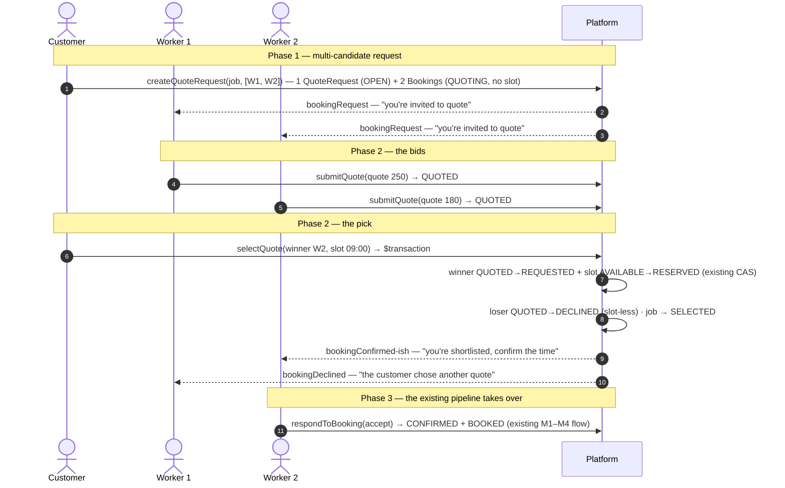

# Multi-Candidate Quotes — "Request quotes from up to 3 workers"

> **Design proposal** (docs/ENHANCEMENT-PLAN.md §2.2 — the structural fix to the selection workflow). Today a customer commits to ONE worker and restarts from scratch on a decline. This sketch lets a customer invite up to **3 workers to quote the same job**, then pick a winner — **reusing the existing `Booking` model as the per-worker quote-and-commitment record**. Everything already built (slot CAS, events, notifications, the M3/M4 rails) does the heavy lifting; the new layer only runs the auction. Decisions here are proposals to confirm before coding — same status as [booking-take-rate.md](booking-take-rate.md) before it landed.

---

## 1. Goal & policy

- A customer posts **one job** (`QuoteRequest`) and invites **up to 3 workers** (explicitly, or platform-matched by category + city + rating).
- Each invited worker responds with a **quote** (reusing the existing quote + optional-deposit inputs) — a *bid*, **not** a commitment.
- The customer picks a **winner** + a concrete **slot** from the winner's availability; the winner's booking claims that slot through the **existing** atomic `AVAILABLE → RESERVED` CAS.
- The losers' bookings are **DECLINED by the system** — slot-less rows, so nothing to free; they become the audit trail and the **quote-benchmark data** (§2.1 in ENHANCEMENT-PLAN).
- Single-candidate bookings are **unaffected** — `quoteRequestId` is null and the flow is byte-for-byte today's.

**Default policy (config, single source of truth):**

| Parameter | Default | Meaning |
|---|---|---|
| `MAX_QUOTE_WORKERS` | `3` | invited workers per job (the "up to 3") |
| `QUOTE_SLA_MS` | `48h` | auto-expire the job when fewer than one quote lands (feeds the request-SLA idea, §2.2) |
| Winner slot claim | at selection | the winner's slot is claimed the moment the customer picks (reuses the existing CAS — no double-booking) |

---

## 2. Why reuse `Booking` (the honest reuse story)

The prisma schema already makes a slot-less booking representable: `Booking.slot` is a **back-relation** — the FK lives on `BookingSlot.bookingId`, which is already `String? @unique`. A `QUOTING` booking is simply a booking **with no slot row linking it**. That means the quote phase needs no new "quote entity":

| Capability | Reused as-is |
|---|---|
| The per-worker record | `Booking` row per invited worker (`number`, `jobTitle`, `quote`, `deposit`, events…) |
| The worker's bid | the existing quote + deposit fields, submitted through the existing `RespondDialog` inputs |
| Winner slot claim | the existing atomic `AVAILABLE→RESERVED` claim inside `prismaCreateBookingRequest` (extracted/reused for an existing booking) |
| Audit trail | `BookingEvent` per transition (REQUESTED→QUOTED→…), unchanged |
| Notifications | the existing `bookingRequest` / `bookingDeclined` / `bookingConfirmed` kinds + the shared `bookingNotification` builder |
| Money (M3/M4) | the winner's booking flows through deposits, checkout, refunds, invoices unchanged |
| Admin story | the funnel + activity feed already count Bookings by status — `QUOTED` rows just appear in the counts |

The only new entity is the **job container** (`QuoteRequest`) that groups the 1..3 worker bookings and owns the customer-side state.

---

## 3. Data model — Prisma proposal

### 3.1 New `QuoteRequest` model

```prisma
enum QuoteStatus {
  OPEN      // created, invites sent, waiting for quotes
  QUOTING   // ≥1 quote submitted, awaiting the customer's pick
  SELECTED  // a winner was chosen — the job moved into a slot-bound Booking
  EXPIRED   // the SLA window passed with no quotes worth picking
  CANCELLED // the customer withdrew the job
}

/// A customer's job post that up to MAX_QUOTE_WORKERS workers bid on. The
/// invited workers ARE its linked Bookings (one Booking per worker, in the
/// QUOTING/QUOTED states, slot-less until the winner is picked).
model QuoteRequest {
  id            String      @id @default(cuid())
  number        String      @unique // QR-YYYY-NNNNN (own sequence — formatQuoteNumber)
  customerId    String?     // null for guests, phone-keyed like Booking
  customer      User?       @relation(fields: [customerId], references: [id], onDelete: SetNull)
  customerName  String
  customerPhone String
  customerEmail String?
  jobTitle      String
  note          String?     @db.Text
  serviceItemId String?
  serviceItem   ServiceItem? @relation(fields: [serviceItemId], references: [id], onDelete: SetNull)
  categorySlug  String      // platform-match hint (city + rating come from the customer city)
  citySlug      String
  status        QuoteStatus @default(OPEN)
  expiresAt     DateTime?   // QUOTE_SLA_MS after creation — the SLA cron clears it
  createdAt     DateTime    @default(now())
  updatedAt     DateTime    @updatedAt

  bookings Booking[] // the invited workers' Bookings (via Booking.quoteRequestId)

  @@index([customerId, status])
  @@index([status, createdAt])
}
```

### 3.2 `Booking` additions (the two schema ripples)

```prisma
enum BookingStatus {
  REQUESTED
  QUOTING        // NEW — invited to a job, no slot yet, bid not submitted
  QUOTED         // NEW — the worker's bid is in, awaiting the customer's pick
  PENDING_PAYMENT
  CONFIRMED
  IN_PROGRESS
  COMPLETED
  CANCELLED
  DECLINED
  NO_SHOW
}

model Booking {
  // …existing columns unchanged…
  startAt       DateTime?    // CHANGED: nullable — QUOTING/QUOTED rows have no time yet
  endAt         DateTime?    // CHANGED: nullable (mirrors startAt)
  quoteRequestId String?
  quoteRequest   QuoteRequest? @relation(fields: [quoteRequestId], references: [id], onDelete: SetNull)
}
```

**The only real ripple:** `startAt`/`endAt` become nullable. The domain type follows (`Booking.startAt?: string`) and the UI already has a pattern for absence (`SlotPicker` empty states, `formatDate` guards). Everything else — `number`, `quote`, `deposit`, `events`, `paymentId`, `lastReminderSent` — is untouched. `BookingSlot` needs **no change** (its `bookingId` is already nullable + unique).

### 3.3 Migration SQL (single migration)

```sql
-- 1) New statuses on the existing enum (Postgres: ADD VALUE inside the migration)
ALTER TYPE "BookingStatus" ADD VALUE 'QUOTING';
ALTER TYPE "BookingStatus" ADD VALUE 'QUOTED';
CREATE TYPE "QuoteStatus" AS ENUM ('OPEN','QUOTING','SELECTED','EXPIRED','CANCELLED');

-- 2) The job container
CREATE TABLE "QuoteRequest" (
  "id" TEXT NOT NULL, "number" TEXT NOT NULL,
  "customerId" TEXT, "customerName" TEXT NOT NULL, "customerPhone" TEXT NOT NULL,
  "customerEmail" TEXT, "jobTitle" TEXT NOT NULL, "note" TEXT,
  "serviceItemId" TEXT, "categorySlug" TEXT NOT NULL, "citySlug" TEXT NOT NULL,
  "status" "QuoteStatus" NOT NULL DEFAULT 'OPEN',
  "expiresAt" TIMESTAMP(3), "createdAt" TIMESTAMP(3) NOT NULL DEFAULT CURRENT_TIMESTAMP,
  "updatedAt" TIMESTAMP(3) NOT NULL,
  CONSTRAINT "QuoteRequest_pkey" PRIMARY KEY ("id"));
CREATE UNIQUE INDEX "QuoteRequest_number_key" ON "QuoteRequest"("number");

-- 3) Booking: nullable times + the link (existing rows keep their values)
ALTER TABLE "Booking" ALTER COLUMN "startAt" DROP NOT NULL;
ALTER TABLE "Booking" ALTER COLUMN "endAt" DROP NOT NULL;
ALTER TABLE "Booking" ADD COLUMN "quoteRequestId" TEXT;
ALTER TABLE "Booking" ADD CONSTRAINT "Booking_quoteRequestId_fkey"
  FOREIGN KEY ("quoteRequestId") REFERENCES "QuoteRequest"("id") ON DELETE SET NULL ON UPDATE CASCADE;
CREATE INDEX "Booking_quoteRequestId_idx" ON "Booking"("quoteRequestId");
```

No backfill: existing bookings keep `startAt`/`endAt` and `quoteRequestId = NULL`. Only the quote path creates the new states.

---

## 4. Domain types + seam

```ts
// src/lib/data/types.ts
export type QuoteStatus = "open" | "quoting" | "selected" | "expired" | "cancelled";
export type BookingStatus = /* …existing… */ | "quoting" | "quoted";

export interface QuoteRequest {
  id: string;
  number: string;            // QR-YYYY-NNNNN
  customerName: string;
  customerPhone: string;
  customerEmail?: string;
  jobTitle: string;
  note?: string;
  serviceItem?: ServiceItem;
  categorySlug: string;
  citySlug: string;
  status: QuoteStatus;
  expiresAt?: string;
  createdAt: string;
  /** The invited workers' bookings (1..MAX_QUOTE_WORKERS) — the bids. */
  bookings: Booking[];
}

// Booking gains:
//   quoteRequestId?: string;
//   quoteRequest?: QuoteRequest;
//   startAt?: string; endAt?: string;   // undefined while QUOTING/QUOTED
```

```ts
// src/lib/data/repo.ts — new seam functions (dual adapter, same rules)
createQuoteRequest(input, workerIds: string[]): Promise<QuoteRequest>
  // 1 QuoteRequest (OPEN) + 1 Booking per worker (QUOTING, NO slot);
  // rejects > MAX_QUOTE_WORKERS or a duplicate worker
getQuoteRequest(idOrNumber, { customerId?, phone? }): Promise<QuoteRequest | null>
submitQuote(bookingId, { quote, deposit? }): Promise<Booking | null>
  // QUOTING → QUOTED; the worker's bid. No slot claim, no commitment.
selectQuote(quoteRequestId, winnerBookingId, slotId): Promise<Booking | null>
  // $transaction: winner QUOTED → REQUESTED + slot AVAILABLE → RESERVED
  // (the EXISTING CAS claim, reused); losers QUOTED → DECLINED; job → SELECTED
expireQuoteRequests(now = new Date()): Promise<number>
  // the SLA cron: OPEN/QUOTING jobs past expiresAt → EXPIRED, open bids DECLINED
```

Server actions (`src/app/actions/bookings.ts`): `createQuoteRequestAction`, `submitQuoteAction`, `selectQuoteAction`, plus the existing cron route (`/api/cron/reminders`) picks up `expireQuoteRequests`.

---

## 5. Service rules (numbered — mirrors booking-scheduling.md §4's five)

1. **Max 3 workers per job** — enforced at create (`MAX_QUOTE_WORKERS`), a duplicate worker id is rejected.
2. **No slot is locked during the auction** — QUOTING/QUOTED bookings hold no slot; the worker's calendar stays free for single-candidate bookings. Only the **winner's** slot is claimed (rule 4).
3. **Bids are not commitments** — `submitQuote` never claims a slot and never flips the slot status; the worker can still take single-candidate jobs while bidding.
4. **Exactly one winner** — `selectQuote` runs the existing atomic `AVAILABLE → RESERVED` CAS on the chosen slot (a concurrent claim by another customer → `slot-taken`, the customer re-picks); the job flips to SELECTED once, losers are DECLINED in the same tx.
5. **Full audit** — every Booking keeps its `BookingEvent` trail; the QuoteRequest status rides the same transitions; the admin funnel counts the new statuses automatically.

---

## 6. Sequence diagram



---

## 7. UI plan

**Customer — `/bookings` gets a "Request quotes" mode** (or tabs on the page):
1. BookingDialog gains a second mode: *"Ask up to 3 workers to quote"* — pick workers from search/favorites (or "let the platform match"), job title, note. Submit → the QuoteRequest card renders.
2. The card lists **one row per worker** with their bid (quote, deposit-if-any, response time — the W1 chips already surface responsiveness) and an **"Accept this quote"** button → the existing SlotPicker on the winner's availability → `selectQuoteAction`.
3. Losers' rows show "Chose another quote"; expired jobs show "Closed".

**Worker — dashboard `Requests` tab:** QUOTING invites render like requests ("Submit your quote" → the existing `RespondDialog` quote/deposit inputs, but the action is `submitQuoteAction`); QUOTED bids show "Awaiting customer decision". The **response-rate** stat counts quote bids as answers automatically (non-REQUESTED — `computeResponseRate` needs no change).

**Notifications:** reuse the existing kinds for v1 — `bookingRequest` (invite), `bookingDeclined` (customer picked another), `bookingConfirmed` (winner's shortlist + final confirm). The `bookingNotification` builder carries the same number/slot/quote context; no new enum values. (Optional v1.1: a dedicated `quoteReceived` kind for the customer — flagged, not required.)

---

## 8. Tests + db:smoke

1. **Unit/demo (`tests/bookings.test.ts`)** — `createQuoteRequest`: 1 job + N Bookings, rejects a 4th worker and duplicates; `submitQuote`: QUOTING→QUOTED, slot untouched; `selectQuote`: winner claims the slot (CAS — a concurrent single-candidate claim loses), losers DECLINED + no orphaned slots (they held none), job→SELECTED once (idempotent re-select no-ops); `expireQuoteRequests`: SLA clears OPEN jobs, declines open bids, frees nothing.
2. **Prisma chain + `db:smoke`** — mirror the booking sections against the live DB: the whole create → 2 bids → select → loser-DECLINED circle, plus the funnel counting QUOTED rows.
3. **i18n** — `booking.quotes*` keys EN/AR (parity test, automatic).

---

## 9. Files touched (summary map)

| File | Change |
|---|---|
| `prisma/schema.prisma` + migration | `QuoteRequest` + `QuoteStatus`; `BookingStatus` + `QUOTING`/`QUOTED`; `Booking.quoteRequestId` FK; `startAt`/`endAt` nullable |
| `src/lib/data/types.ts` | `QuoteStatus`, `QuoteRequest`, `BookingStatus` + 2 values, `Booking.startAt/endAt/quoteRequest*` optional, `formatQuoteNumber` |
| `src/lib/data/bookings.ts` + `prisma-repo.ts` | demo + prisma `createQuoteRequest`/`submitQuote`/`selectQuote`/`expireQuoteRequests` (CAS reuse in the prisma tx) |
| `src/lib/data/repo.ts` | 4 new seams (dual-adapter branch) |
| `src/app/actions/bookings.ts` | 3 new server actions (+ cron hook for expiry) |
| UI | BookingDialog "request quotes" mode, QuoteRequest card in `/bookings`, worker Requests tab bid affordance |
| i18n | `booking.quotes*` keys EN/AR |
| Tests | `tests/bookings.test.ts`, prisma chain test, `db:smoke` section |

**Sequencing recommendation:** calculator-free — the only new money logic is none (bids reuse quote/deposit). Land the model + seams + demo/prisma adapters first, then the UI + i18n, then the chain/smoke tests as the gate — the same order M3/M4 landed.

---

## 10. Open decisions (confirm before coding)

1. **Slot at pick time** — the customer picks the winner AND a slot in one step (sketched), or the winner proposes times after being shortlisted? One-step is simpler; two-step protects against the customer picking a slot the worker can't make.
2. **Transparency** — does a worker see "2 other workers were invited" / the competing quotes? Hiding quotes until the pick avoids a race-to-the-bottom on price; showing them maximizes price discovery. Sketch defaults to **hidden** (bids are sealed).
3. **Bid firmness** — is the winning bid binding at the worker's quoted price (yes, sketch default — the quote is the commitment once selected), or can the worker re-quote at the confirm step?
4. **Deposit at bid time** — some marketplaces require a deposit with the bid to filter tyre-kickers. v1 keeps deposits optional at the winning-booking stage (M3 rails) — revisit after usage data.
5. **Platform-match invites** — the "let the platform match" mode needs the matching query (category + city + rating + the W1 signals). Explicit pick is the v1 scope; matching is a thin extension of `searchWorkers`.

---

**Related docs:** [selection-workflow.md](selection-workflow.md) (the four phases this extends) · [booking-scheduling.md](booking-scheduling.md) (the Booking rails + five rules) · [ENHANCEMENT-PLAN.md](ENHANCEMENT-PLAN.md) §2.2 (the backlog item) · [booking-take-rate.md](booking-take-rate.md) (where winning quotes become fee revenue).
