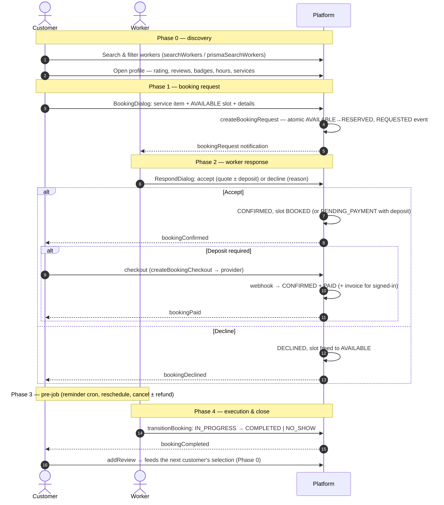

# Worker ↔ Customer Selection Workflow

[← Back to docs index](README.md)

**Status:** ✅ Live. The workflow below is implemented end-to-end in BOTH adapters — the demo in-memory store (`src/lib/data/bookings.ts`, no database needed) and the production Prisma layer (`src/lib/data/prisma-repo.ts`, `DEMO_MODE=false`) — through the shared repository seam (`src/lib/data/repo.ts`). The UI never changes between modes; the two adapters enforce identical service rules (see [booking-scheduling.md](booking-scheduling.md) §4 for the canonical five rules). This document is the companion to the booking doc: it tells the **selection story** — how a customer and a worker choose each other, step by step, and where each step lives in code.

---

## The four phases at a glance

| Phase | Who acts | Outcome |
|---|---|---|
| **0 — Discovery** | Customer | Shortlists candidates from search, filters, profiles, reviews |
| **1 — Booking request** | Customer | Commits to a service + slot → `REQUESTED`, slot `RESERVED` |
| **2 — Worker response** | Worker | Accepts (quote ± deposit) or declines → `CONFIRMED` / `PENDING_PAYMENT` / `DECLINED` |
| **3 — Pre-job** | Both | Reminder, reschedule, cancellation (± deposit refund policy) |
| **4 — Execution & close** | Worker + Customer | `IN_PROGRESS` → `COMPLETED` / `NO_SHOW`, then the customer's review feeds the next selection |

---

## Phase 0 — Discovery: the customer selects candidates

The customer never picks a worker blindly — everything they judge on is verifiable.

1. **Search & browse** — the homepage (`src/components/home/hero.tsx`, `search-bar.tsx`, `categories-grid.tsx`, `featured-workers.tsx`) and `/search` (`src/app/search/page.tsx` + `src/components/search/search-client.tsx`) with filters (category, city/area, min rating, price band, min experience, verified / featured / emergency / open-now / available-now) and 7 sort modes (relevance, rating, reviews, price ↑/↓, experience, nearest — haversine). Engine: `searchWorkers` / `getSuggestions` / `POPULAR_SEARCHES` in `src/lib/data/search.ts`; real-mode mirror `prismaSearchWorkers` in `src/lib/data/prisma-repo.ts`; URL plumbing in `src/lib/data/search-params.ts`. Search analytics feed the admin search-trends card.
2. **Profile review** — `/workers/[slug]` (`src/app/workers/[slug]/page.tsx`) renders the profile hero (rating, review count, years of experience, **Verified / Premium / Emergency** badges), services with prices, working hours, certifications, portfolio, location map (`src/components/worker/profile-hero.tsx`, `profile-tabs.tsx`, `reviews-section.tsx`, `contact-card.tsx`, `map-embed.tsx`). The Verified badge is admin-granted through the verification workflow; ratings come from real customer reviews (`addReview` in `repo.ts`).
3. **Favorites** — shortlist candidates (`src/components/favorites/favorites-client.tsx`, `src/app/favorites/page.tsx`).
4. **Related workers** — `related-workers.tsx` suggests alternatives so the customer compares before committing.

## Phase 1 — The customer commits: booking request

On the worker profile, the **BookingDialog** (`src/components/worker/booking-dialog.tsx`) walks three steps:

1. **Service item** — `service-picker.tsx`: pick from the worker's priced services (hour/job, from the `ServiceItem` set).
2. **Slot picker** — `slot-picker.tsx`: only **AVAILABLE** slots are selectable. Slots materialize from the worker's weekly `WorkingHour` template via `generateSlots` (`src/lib/data/bookings.ts` demo / `prismaGenerateSlots` in `prisma-repo.ts`, seam + `generateSlotsAction` in `src/app/actions/bookings.ts`); the dashboard's **AvailabilityPanel** (`src/components/dashboard/bookings/availability-panel.tsx`) shows the next 7 days with block/unblock toggles. Blocked, closed, past, and already-booked slots are excluded.
3. **Details** — name, phone (**guest bookings are phone-keyed** — no account needed), email, job title, note.

Submitting calls **`requestBookingAction`** (`src/app/actions/bookings.ts`) → seam **`createBookingRequest`** (`repo.ts`) → `demoCreateBookingRequest` / **`prismaCreateBookingRequest`** which, inside `prisma.$transaction`:

- **Claims the slot** with an atomic compare-and-swap (`updateMany WHERE status=AVAILABLE` → `RESERVED`) — a concurrent request matching 0 rows gets `slot-taken` (no double-booking, rule 1).
- Runs the **overlap guard** first (rule 2): the request must not clash with the worker's other RESERVED/BOOKED/BLOCKED slots.
- Appends the `REQUESTED` `BookingEvent` (rule 5) and assigns a booking number (`BK-NNNN`).
- Notifies the worker (**`bookingRequest`** type, in-app + email): a customer is asking for their services.

## Phase 2 — The worker's selection: accept, decline, or counter

The worker chooses on the dashboard (**`src/components/dashboard/worker-dashboard.tsx`** → **`BookingsPanel`** in `bookings-panel.tsx`, Requests/Upcoming/Past tabs + a computed **response-rate** stat). Each request opens the **`RespondDialog`** (`respond-dialog.tsx`):

- **Accept** — the worker sets a **quote** (prefilled from `priceMin`) and can require a **deposit**. Accept → **CONFIRMED**, slot → **BOOKED**; the customer is notified (**`bookingConfirmed`**) with the number, slot and quote.
- **Accept with deposit** → **PENDING_PAYMENT**: the customer pays via the hosted checkout — `payBookingAction` → `createBookingCheckout` (seam) → the provider seam `src/lib/payments/` (`stripe.ts` / `simulated.ts`; simulated mints a signed local URL, Stripe requires keys). The webhook (`POST /api/payments/webhook`, `GET /api/payments/simulate`) → `confirmBookingPayment` → `prismaConfirmBookingPayment` CAS-flips `PENDING_PAYMENT → CONFIRMED` + payment `PENDING → PAID` in one tx and notifies (**`bookingPaid`**); signed-in customers get a `WA-YYYY-NNNNN` invoice (guest bookings skip it).
- **Decline** — with a reason; the slot is freed back to **AVAILABLE** (rule 3) and the customer is notified (**`bookingDeclined`**).

Actions: `respondBookingAction` → seam `respondToBooking` → `demoRespondToBooking` / `prismaRespondToBooking` ($transaction, CAS on `REQUESTED`).

## Phase 3 — Pre-job: reminders, rescheduling, cancellation

- **Reminder** — `GET /api/cron/reminders` → `runBookingReminderEngine` (`src/lib/notifications/reminders.ts`) fires **`bookingReminder`** ("job starts tomorrow") to the customer within 24h of a CONFIRMED start; `Booking.lastReminderSent` is a CAS-claimed idempotency stamp so overlapping cron runs never double-send.
- **Reschedule** — either party can move the job to another AVAILABLE slot: `rescheduleBookingAction` → seam `rescheduleBooking` → `prismaRescheduleBooking` (atomic swap: old slot freed, target claimed `AVAILABLE → BOOKED`, `RESCHEDULED` audit event, **`bookingRescheduled`** to the other party).
- **Cancel** — either party, with a reason stored on the row + audit event (`cancelBookingAction` → `cancelBooking` → `prismaCancelBooking`; slot freed, rule 3). Deposit refunds follow **`bookingCancelRefundDue`** (`src/lib/data/types.ts` — the single policy constant shared by both adapters): a worker cancel **more than `BOOKING_CANCEL_REFUND_WINDOW_MS` (24h) before start** refunds the deposit via the provider (payment → `REFUNDED`); within the window the deposit is kept; customer/system cancels always refund. Notifications: **`bookingCancelled`** to the other party, **`bookingRefund`** (amount + reason) when a deposit actually lands back.

## Phase 4 — Execution & closing the loop

- The worker starts the job (**IN_PROGRESS**), then marks **COMPLETED** (**`bookingCompleted`** to the customer) or **NO-SHOW** (job voided). The state machine lives in `BOOKING_TRANSITION_FROM` (`src/lib/data/types.ts`) and is re-asserted by a CAS in `prismaTransitionBooking`; illegal transitions are rejected. Actions: `transitionBookingAction` → seam `transitionBooking`.
- The customer's post-job **review** (`addReview`) updates the worker's rating/reviewCount — closing the loop straight back into Phase 0 for the next customer's selection.

---

## Trust & fairness guarantees

| Guarantee | Mechanism |
|---|---|
| **No double-booking** | Atomic `AVAILABLE→RESERVED` CAS + overlap guard, both inside `$transaction` (rules 1–2) |
| **Declining frees the slot** | Decline → slot back to `AVAILABLE`, `bookingId` cleared (rule 3) |
| **Full audit trail** | Every transition appends a `BookingEvent` (rule 5); the admin dispute view (`/admin/bookings/[number]`) reconstructs the timeline from the same data the funnel and activity feed read |
| **Both parties notified at every transition** | `bookingRequest` / `bookingConfirmed` / `bookingDeclined` / `bookingCancelled` / `bookingReminder` / `bookingCompleted` / `bookingPaid` / `bookingRescheduled` / `bookingRefund` — in-app + email variants (multi-channel dispatcher) |
| **Fair money** | Amounts are integer minor units; the refund policy is one shared constant, so both adapters can never drift |
| **Funnel ↔ feed lockstep** | Booking lifecycle events log to the admin activity feed (`BOOKING_REQUESTED / CONFIRMED / CANCELLED / RESCHEDULED / NO_SHOW`) with the booking number, so the admin funnel's counts and Recent activity tell the same story |

---

## Sequence diagram

---

## Reference — where each step lives

| Step | Server logic | UI | Actions |
|---|---|---|---|
| Search & filters | `src/lib/data/search.ts`, `prismaSearchWorkers` (`src/lib/data/prisma-repo.ts`) | `src/app/search/page.tsx`, `src/components/search/search-client.tsx`, `src/components/home/*` | — |
| Profile & reviews | `getWorkerBySlug` (`repo.ts`), `addReview` | `src/app/workers/[slug]/page.tsx`, `src/components/worker/*` | — |
| Slot availability (M2) | `generateSlots` / `prismaGenerateSlots`, `setSlotBlocked` / `prismaSetSlotBlocked` | `slot-picker.tsx`, `availability-panel.tsx` | `generateSlotsAction`, `setSlotBlockedAction` |
| Booking request | `createBookingRequest` → `prismaCreateBookingRequest` | `booking-dialog.tsx` (+ `service-picker`, `slot-picker`) | `requestBookingAction` |
| Worker response | `respondToBooking` → `prismaRespondToBooking` | `bookings-panel.tsx`, `respond-dialog.tsx` | `respondBookingAction` |
| Deposit & invoice (M3) | `createBookingCheckout` / `prismaCreateBookingCheckout`, `confirmBookingPayment` / `prismaConfirmBookingPayment` | customer `/bookings` pay card | `payBookingAction`, `confirmPaymentAction` |
| Pre-job (M4) | reminder engine, `rescheduleBooking`, `cancelBooking` (+ `bookingCancelRefundDue`) | worker + customer booking rows | `rescheduleBookingAction`, `cancelBookingAction` |
| Execution (M4) | `transitionBooking` / `prismaTransitionBooking` (`BOOKING_TRANSITION_FROM`) | `booking-actions.tsx` | `transitionBookingAction` |
| Notifications | `src/lib/data/notifications.ts`, `src/lib/notifications/*`, `booking-notifications.ts` | bell + `/notifications` | — |
| Audit & admin | `src/lib/data/activity.ts` (`ACTION_CODES`), dispute view | `/admin`, `/admin/bookings/[number]` | — |

---

**Related docs:** [booking-scheduling.md](booking-scheduling.md) (service rules, data model, M1–M4), [booking-customer-ui.md](booking-customer-ui.md) (customer-side UI plan), [PAYMENTS.md](PAYMENTS.md) (deposits, invoices, refund policy), [PRODUCT.md](PRODUCT.md) (product & features plan).
